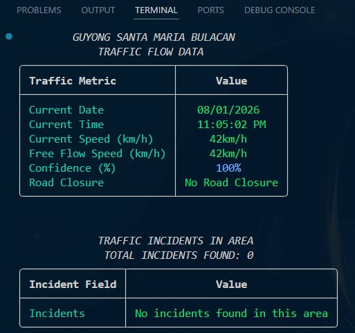
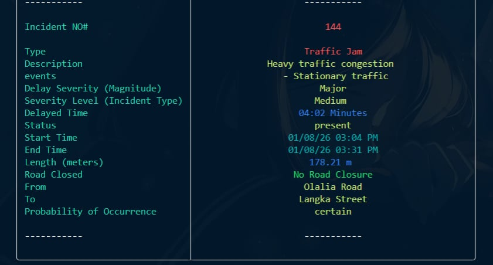
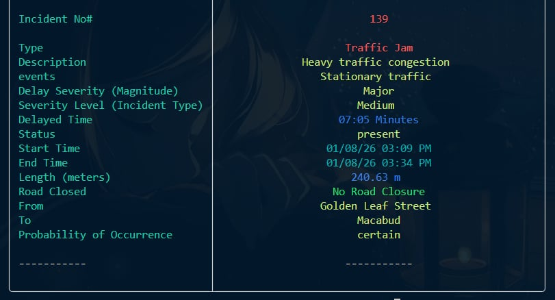

# SmartFlow

A barangay-level traffic monitoring system built as a hands-on project for learning **Python** and **API integration**.  
This project uses the **TomTom Traffic API** to fetch **real-time traffic flow** and **incident data** for barangays in Santa Maria, Bulacan.  

The **CLI (Command-Line Interface)** application is made for the finals requirement on the course **Programing Language and Design** with the course code **CMPE 102** for the First Semester of SY 2025-2026.

---
## 📦 Getting Started

### Requirements
- Python 3.x 
- Required libraries:
  - `requests`
  - `json`
  - `os`
  - `threading`
  - `rich`
  - `tabulate`
  - `itertools`
  - `time`

#### Install dependencies:
```bash
pip install requests rich tabulate
```

#### Environment Setup:

This project uses **TomTom API Key**
Set it as an environment variable:

Linux/macOS
```bash
export TOMTOM_API_KEY="your_api_key_here"
```

Windows (Powershell)
```Powershell
setx TOMTOM_API_KEY "your_api_key_here"
```
---
### Running the Program
```bash / CMD & Powershell
python SmartFlow.py
python3 SmartFlow.py
```
---
## 🚦 Features
- Fetch traffic flow data via TomTom API:
  - Current speed
  - Free flow speed
  - Confidence percentage
  - Road closure status

- Fetch incident data via TomTom API:
  - Type, description, severity
  - Start and end time
  - Length of affected road
  - Road closure status

- Show results in formatted tables using `rich`

- Error handling for invalid inputs and API issues

## 🖼️ Sample Outputs
- Sample 1 (Traffic flow, no incident)
<p align="center">
   
</p>

- Sample 2 & 3 (With incident)
<p align="center">
  
  
</p>

---
## 👥 Authors

- Genon, Jomari (Main Developer)
- Mamayson, Gabriel Luiz (Co-Developer)
- David, John Carlos (Idea Author)
- Group `SyntaxError;`, BSCPE 1-1
- Made with ❤️ lovelots po salamat~

---

